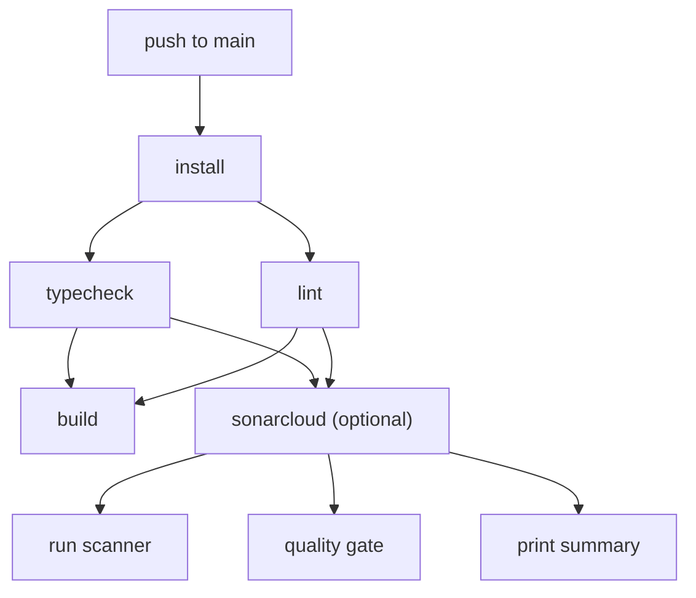

# SonarQube / SonarCloud Setup Guide

This document explains how SonarQube static analysis works in this project,
how to configure it from scratch, and how to fix the most common problems.

Read this before touching anything in `sonar-project.properties`, the CI
workflow, or the Docker service.

---

## Table of contents

1. [Overview — two environments](#1-overview--two-environments)
2. [Local setup (Docker)](#2-local-setup-docker)
3. [SonarCloud setup (CI)](#3-sonarcloud-setup-ci)
4. [Configuration files](#4-configuration-files)
5. [How the CI job works](#5-how-the-ci-job-works)
6. [Common errors and how to fix them](#6-common-errors-and-how-to-fix-them)
7. [Adding / removing source directories](#7-adding--removing-source-directories)
8. [Adding a new package with its own tsconfig](#8-adding-a-new-package-with-its-own-tsconfig)
9. [FAQ](#9-faq)

---

## 1. Overview — two environments

The scanner runs in two different places, hitting two different servers:

| Where         | Server            | Triggered by               | Token needed? |
|---------------|-------------------|----------------------------|---------------|
| Your machine  | Local SonarQube (Docker, port 9000)  | `make audit` or `make sonar-scan` | No (CE default has no auth) |
| GitHub Actions | SonarCloud (sonarcloud.io)          | Push/PR to main, develop, fix/*, feat/* | Yes (`SONAR_TOKEN` secret) |

Both environments read the **same** `sonar-project.properties` file.
The only difference is the server URL:

- Locally, `run-scan.sh` passes `-Dsonar.host.url=http://localhost:9000`.
- In CI, the `SONAR_HOST_URL` environment variable is set to `https://sonarcloud.io`.

**Do not** put `sonar.host.url` directly in `sonar-project.properties`.
If you do, the scanner sees both the property file value and the environment
variable, concatenates them, and produces an invalid URL.  This was a real
problem during initial setup and was very hard to diagnose.

---

## 2. Local setup (Docker)

### Prerequisites

- Docker and Docker Compose
- `.env` file at the project root (copy from `.env.example`)

### Start SonarQube

```bash
make sonar-up
```

This starts the Redis and SonarQube containers and waits (up to 3 minutes)
for SonarQube to report UP.  First boot is slow because Elasticsearch has
to initialize.  Subsequent starts take about 10 seconds.

Open [http://localhost:9000](http://localhost:9000) to see the dashboard.
Default credentials: `admin` / `admin` (you will be prompted to change the
password on first login).

### Run a scan

```bash
make sonar-scan   # scanner only (SonarQube must already be running)
make audit        # typecheck + lint + scanner (starts SonarQube if needed)
```

`make audit` is the recommended workflow — it runs TypeScript type-checking,
ESLint, and the SonarQube scanner in order, and stops on the first failure.

### Stop SonarQube

```bash
make down         # stops all containers
```

Data is persisted in Docker volumes (`sonarqube_data`, `sonarqube_logs`,
`sonarqube_extensions`).  To destroy everything and start fresh:

```bash
docker compose down -v
```

### Files involved

| File | Purpose |
|------|---------|
| `docker-compose.yml` (sonarqube + redis services) | Container definitions, ports, volumes |
| `services/sonarqube/Dockerfile` | Base image (CE 25.4), labels |
| `services/sonarqube/conf/sonar.properties` | Server-side config (logging, memory limits) |
| `services/sonarqube/tools/wait-sonarqube.sh` | Polls health endpoint until server is UP |
| `services/sonarqube/tools/run-scan.sh` | Wraps `sonar-scanner` with correct arguments |
| `sonar-project.properties` | Scanner-side config (project key, sources, exclusions) |

---

## 3. SonarCloud setup (CI)

This is the part that requires careful attention.  Multiple things have to
line up exactly or the scanner will fail with confusing error messages.

### Step 1 — Create the project on SonarCloud

1. Go to [https://sonarcloud.io](https://sonarcloud.io) and sign in with GitHub.
2. Click **+** → **Analyze new project**.
3. Select the repository `notion-database-sys`.
4. Note down the **project key** and **organization** that SonarCloud assigns.
   They are usually `<Org>_<repo-name>` and `<org-lowercase>`.

**The project key is case-sensitive.**  In our case:
- Organization: `univers42`
- Project key: `Univers42_notion-database-sys` (capital `U`)

If the key in `sonar-project.properties` does not match exactly, the scanner
will fail with "Could not find a default branch for project".

### Step 2 — Disable Automatic Analysis

SonarCloud enables "Automatic Analysis" by default on new projects.  This
conflicts with CI-based scanning.  If both are active, the scanner exits
with this error:

> You are running CI analysis while Automatic Analysis is enabled.
> Please consider disabling one or the other.

To disable it:

1. Go to **Project Settings** → **Analysis Method**
   ([direct link](https://sonarcloud.io/project/analysis_method?id=Univers42_notion-database-sys))
2. Toggle **Automatic Analysis** to **OFF**.

### Step 3 — Add the repository secret

The scanner authenticates with a token.  Generate one at:

**SonarCloud** → **My Account** → **Security** → **Generate Token**

Then add it to GitHub:

```bash
gh secret set SONAR_TOKEN
# paste the token when prompted
```

The secret **must** be named `SONAR_TOKEN`.  The CI workflow reads it as
`${{ secrets.SONAR_TOKEN }}`.  If you name it something else (e.g. `NOTION`),
the scanner will run without authentication and fail.

You can verify the secret exists:

```bash
gh secret list
# should show:
# SONAR_TOKEN  Updated 2026-04-04
```

### Step 4 — Verify the project key matches

Open `sonar-project.properties` and check these two lines:

```properties
sonar.projectKey=Univers42_notion-database-sys
sonar.organization=univers42
```

Compare them with what SonarCloud shows at:
[https://sonarcloud.io/project/information?id=Univers42_notion-database-sys](https://sonarcloud.io/project/information?id=Univers42_notion-database-sys)

If the case does not match, fix the properties file.  You can also query the
API to find your exact project key:

```bash
curl -sf "https://sonarcloud.io/api/projects/search?organization=univers42" \
  | python3 -m json.tool
```

### Step 5 — Push and check the Actions log

Push to any triggering branch (`main`, `develop`, `fix/*`, `feat/*`).
The SonarCloud job runs after typecheck and lint pass.  At the end of the
job log, a summary step prints metrics:

```
──────────────────────────────────────────────────
  SonarCloud Analysis Summary
──────────────────────────────────────────────────

  Lines of Code:             8234
  Bugs:                      0
  Vulnerabilities:           0
  Security Hotspots:         3
  Code Smells:               12
  Duplication:               2.1%
  Coverage:                  n/a%

  Dashboard: https://sonarcloud.io/dashboard?id=Univers42_notion-database-sys&branch=main
──────────────────────────────────────────────────

OK: No bugs or vulnerabilities detected.
```

If the job fails, read section 6.

---

## 4. Configuration files

### sonar-project.properties (project root)

This is the main file the scanner reads.  Key settings:

| Property | Value | Why |
|----------|-------|-----|
| `sonar.projectKey` | `Univers42_notion-database-sys` | Must match SonarCloud exactly (case-sensitive) |
| `sonar.organization` | `univers42` | SonarCloud organization slug |
| `sonar.sources` | `src,packages,playground,services/dbms` | Directories to scan |
| `sonar.inclusions` | `**/*.ts,**/*.tsx` | Only TypeScript files |
| `sonar.exclusions` | (see file) | node_modules, dist, build, submodules, WASM pkg |
| `sonar.typescript.tsconfigPaths` | (5 tsconfig.json paths) | Lets the scanner resolve types across the monorepo |
| `sonar.qualitygate.wait` | `true` | Scanner blocks until quality gate result is ready |

### .github/workflows/ci.yml (sonarqube job)

The CI job:

1. Checks if `SONAR_TOKEN` is set.  If not, it skips all remaining steps.
2. Checks out the repo with full git history (`fetch-depth: 0`) — needed
   for blame data and new code detection.
3. Runs `SonarSource/sonarqube-scan-action@v6`.
4. Waits for the quality gate with `SonarSource/sonarqube-quality-gate-action@v1`.
5. Queries the SonarCloud API and prints a metrics summary to the log.

The job has `continue-on-error: true` so a scanner failure does not block
merges.  The build and lint jobs are the hard gates.

### services/sonarqube/conf/sonar.properties

Server-side config for the **local Docker instance only**.  This has no
effect on SonarCloud.  It sets memory limits, logging level, and disables
telemetry.

---

## 5. How the CI job works



The sonarcloud job depends on typecheck and lint.  If either fails, the
scanner never runs.  This avoids wasting SonarCloud analysis quotas on
code that does not compile.

GitHub Actions does **not** allow `secrets` in job-level `if:` conditions.
That is why the token check is done inside a step that writes a `skip`
output.  All subsequent steps are conditioned on `steps.check.outputs.skip != 'true'`.

---

## 6. Common errors and how to fix them

### "Could not find a default branch for project with key '...'"

**Cause:** The project key in `sonar-project.properties` does not match
what is registered on SonarCloud.  The key is case-sensitive.

**Fix:** Query the API to find the correct key:

```bash
curl -sf "https://sonarcloud.io/api/projects/search?organization=univers42"
```

Update `sonar.projectKey` in `sonar-project.properties` to match exactly.

---

### "You are running CI analysis while Automatic Analysis is enabled"

**Cause:** SonarCloud has two analysis modes and they conflict.

**Fix:** Go to Project Settings → Analysis Method → disable Automatic Analysis.
See [Step 2](#step-2--disable-automatic-analysis).

---

### Scanner exits with "Not authorized" or empty SONAR_TOKEN

**Cause:** The GitHub Actions secret is missing or has the wrong name.

**Fix:** Check with `gh secret list`.  The secret must be named exactly
`SONAR_TOKEN`.  If it has a different name, delete it and re-create it:

```bash
gh secret delete WRONG_NAME
gh secret set SONAR_TOKEN
```

---

### "Unrecognized named-value: 'secrets'" in workflow YAML

**Cause:** You tried to use `secrets.SONAR_TOKEN` in a job-level `if:`
condition.  GitHub Actions does not support the `secrets` context at
job level.

**Fix:** Move the check into a step (this is how the workflow already works).
See the `Check for SONAR_TOKEN` step in `ci.yml`.

---

### Scanner connects but produces an invalid URL

**Cause:** `sonar.host.url` is set in both `sonar-project.properties` and
the `SONAR_HOST_URL` environment variable.  The scanner concatenates them.

**Fix:** Remove `sonar.host.url` from `sonar-project.properties`.  The
environment variable is sufficient.  Locally, `run-scan.sh` passes the
URL via `-Dsonar.host.url=...`.

---

### Quality gate times out

**Cause:** The SonarCloud analysis report takes too long to process.

**Fix:** Increase `sonar.qualitygate.timeout` in `sonar-project.properties`
(default: 120 seconds).  In CI, the `sonarqube-quality-gate-action` has its
own `timeout-minutes: 5`.

---

### "No files indexed" or "0 source files to be analyzed"

**Cause:** The `sonar.sources` paths do not match the repo layout, or
`sonar.inclusions` is filtering out everything.

**Fix:** Check that the directories listed in `sonar.sources` exist and
contain `.ts` or `.tsx` files.  Run the scanner locally with
`-Dsonar.verbose=true` to see which files are being considered:

```bash
npx sonar-scanner \
  -Dsonar.host.url=http://localhost:9000 \
  -Dsonar.verbose=true
```

---

### SonarQube Docker container keeps restarting

**Cause:** Usually an out-of-memory error in Elasticsearch.

**Fix:** Check logs with `docker compose logs sonarqube`.  If you see
`OutOfMemoryError`, increase the heap sizes in
`services/sonarqube/conf/sonar.properties`:

```properties
sonar.search.javaOpts=-Xmx512m -Xms512m
sonar.web.javaOpts=-Xmx768m -Xms256m
sonar.ce.javaOpts=-Xmx768m -Xms256m
```

Also make sure your Docker daemon has at least 4 GB of memory allocated.

---

### CI does not trigger on fix/* or feat/* branches

**Cause:** The workflow trigger patterns are defined in the YAML file on the
**default branch** (usually `main`).  If `main` does not have the patterns,
pushes to those branches are ignored even if the branch itself has the
updated YAML.

**Fix:** Merge your workflow changes into `main` first.

---

## 7. Adding / removing source directories

If you add a new top-level directory that contains TypeScript files:

1. Add it to `sonar.sources` in `sonar-project.properties`:
   ```properties
   sonar.sources=src,packages,playground,services/dbms,new-dir
   ```

2. If the directory should also be linted in CI, add a lint step in
   `.github/workflows/ci.yml`:
   ```yaml
   - name: Lint new-dir/
     run: pnpm eslint new-dir/ --max-warnings=0
   ```

3. Update the `lint` target in the Makefile to include the directory:
   ```makefile
   lint:
   	pnpm eslint src/ packages/ playground/ services/dbms/ new-dir/ --max-warnings=0
   ```

If you want to exclude a directory from SonarQube analysis, add it to
`sonar.exclusions`.

---

## 8. Adding a new package with its own tsconfig

When you create a new package (e.g. `packages/utils`) with its own
`tsconfig.json`, add its path to both:

1. `sonar-project.properties`:
   ```properties
   sonar.typescript.tsconfigPaths=tsconfig.json,...,packages/utils/tsconfig.json
   ```

2. Root `tsconfig.json` references (if using project references).

Without this, the scanner cannot resolve types from the new package and
will report false positive issues.

---

## 9. FAQ

**Q: Do I need a SonarCloud account to run local scans?**
No.  Local scans hit the Docker SonarQube instance, which has no auth by
default.

**Q: Is the SonarCloud scan mandatory for merging?**
No.  The job has `continue-on-error: true`.  A scan failure shows as a
warning but does not block the PR.  TypeScript type-checking and ESLint
are the hard gates.

**Q: Can I run the SonarCloud scan locally?**
Yes, if you have a `SONAR_TOKEN`:
```bash
SONAR_HOST_URL=https://sonarcloud.io \
SONAR_TOKEN=your-token \
npx sonar-scanner
```

**Q: Where is the SonarCloud dashboard?**
[https://sonarcloud.io/dashboard?id=Univers42_notion-database-sys](https://sonarcloud.io/dashboard?id=Univers42_notion-database-sys)

**Q: How do I regenerate the token?**
SonarCloud → My Account → Security → Revoke the old token → Generate a new
one → update the GitHub secret with `gh secret set SONAR_TOKEN`.

**Q: The scanner found issues. How do I see the details?**
Open the SonarCloud dashboard link from the CI log summary.  Click on the
metric (Bugs, Code Smells, etc.) to see the file-level breakdown.
