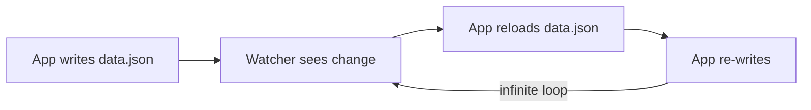

# Atomic File Writes & Self-Write Detection

## Atomic Writes: Temp + Rename

When writing to JSON or CSV data files, a crash mid-write would leave a corrupted file. The fix:

```ts
// JsonDbAdapter.ts
import { writeFileSync, renameSync } from 'fs';

function saveToFile(path: string, data: object): void {
  writeFileSync(path + '.tmp', JSON.stringify(data, null, 2));
  renameSync(path + '.tmp', path);
}
```

Why this works:
1. `writeFileSync` writes to a temporary file (`data.json.tmp`)
2. If the process crashes during write, only the `.tmp` file is corrupted — the original is untouched
3. `renameSync` is an atomic operation on most filesystems (ext4, APFS, NTFS) — the old file is replaced in a single kernel operation
4. If the process crashes during rename... well, that basically can't happen (it's a metadata update, not a data write)

## Self-Write Detection

The file watcher monitors data files for changes (to support external edits with another tool). But when the app itself writes to a file, the watcher would see that as an external change and trigger a reload loop:



The fix: mark your own writes.

```ts
// jsonOps.ts
const ownWrites = new Set<string>();

function markOwnWrite(path: string): void {
  ownWrites.add(path);
  // Auto-cleanup after the watcher would have fired
  setTimeout(() => ownWrites.delete(path), 500);
}

function writeData(path: string, records: object[]): void {
  markOwnWrite(path);
  writeFileSync(path, JSON.stringify(records, null, 2));
}

// fileWatcher.ts
function onFileChange(path: string): void {
  if (ownWrites.has(path)) return;  // Ignore self-caused changes
  reloadFromDisk(path);
}
```

The 500ms timeout means the flag is temporary — if the user edits the file externally 600ms later, the watcher will correctly pick it up.

## Why Not a Database Instead of Files?

For the `json` and `csv` backends, flat files are the whole point:
- Zero infrastructure — no Docker, no server process
- Human-readable — open the JSON file and see your data
- Git-friendly — you can commit your database alongside your code
- Great for small datasets and development

The file-based backends are the default for a reason: instant setup. When you need scale, switch to MongoDB or PostgreSQL with a single env variable change.

## Tradeoffs

- **Temp+rename adds one extra I/O operation.** On an SSD, `renameSync` is ~50μs. Negligible.
- **The self-write window (500ms) is a race condition.** If someone manages to edit the file within 500ms of an app write, the external edit is lost. In practice, no human edits a JSON file that fast.
- **`writeFileSync` blocks the event loop.** For a dev server handling one user, this is fine. For production with concurrent users, you'd use the async adapters (MongoDB/PostgreSQL).

## References

- [Node.js — `fs.renameSync()`](https://nodejs.org/api/fs.html#fsrenamesyncoldpath-newpath) — The synchronous rename API used for atomic file replacement.
- [Linux man page — `rename(2)`](https://man7.org/linux/man-pages/man2/rename.2.html) — POSIX specification guaranteeing that `rename()` is atomic on the same filesystem.
- [Node.js — `fs.writeFileSync()`](https://nodejs.org/api/fs.html#fswritefilesyncfile-data-options) — Writing the temp file before the atomic rename.
