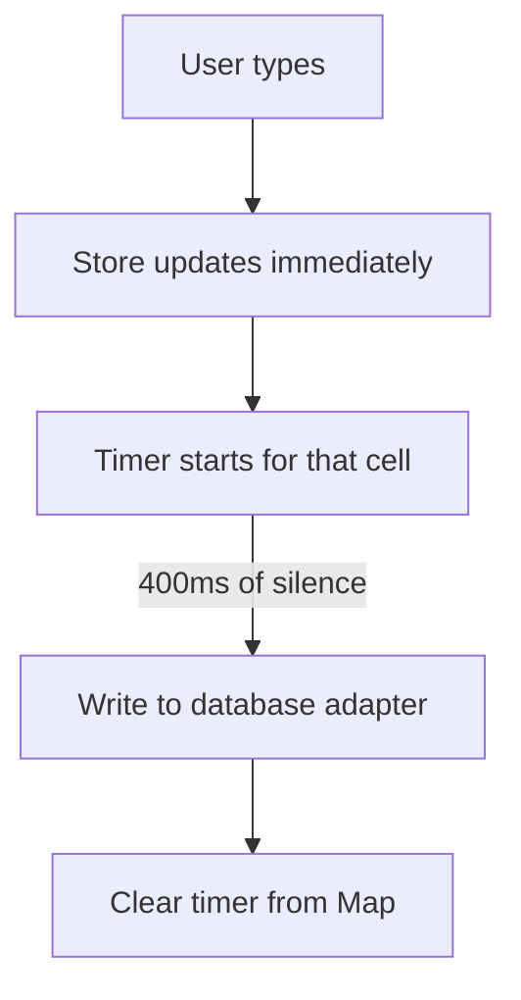

# Per-Key Debounced Persistence

## The Problem

The user is editing a cell. They type "Hello W" — that's 7 keystrokes. Each one updates the Zustand store immediately (so the UI is responsive). But you don't want to hit the database 7 times. You want to debounce.

**Naive approach — global debounce:**
```ts
let timer: number;
function persist(pageId, field, value) {
  clearTimeout(timer);
  timer = setTimeout(() => writeToDB(pageId, field, value), 400);
}
```

Problem: if the user edits cell A, then quickly edits cell B, the timer for cell A gets cleared by cell B. Cell A's change is lost.

## Per-Key Debounce

Each cell gets its own timer, keyed by `pageId::fieldName`:

```ts
const persistTimers = new Map<string, ReturnType<typeof setTimeout>>();

function persistPageProperty(pageId: string, propName: string, value: unknown, source: string) {
  // Guard: don't write to a source that was switched away from
  if (isStaleSource(source)) return;

  const key = `${pageId}::${propName}`;
  clearTimeout(persistTimers.get(key));
  persistTimers.set(key, setTimeout(() => {
    dispatchOps('updateField', source, { pageId, field: propName, value });
    persistTimers.delete(key);
  }, 400));
}
```

Now editing cell A and cell B creates two independent timers. Each flushes after 400ms of inactivity on that specific cell.

## The Stale Source Guard

```ts
if (isStaleSource(source)) return;
```

Scenario:
1. User is on the `json` backend
2. User edits a cell — timer starts (400ms)
3. User switches to `mongodb` backend (via the dropdown)
4. Timer fires — tries to write to `json`
5. But the active source is now `mongodb` — the write would be wrong

The `isStaleSource` check compares the source the timer was created for against the current active source. If they don't match, the write is silently dropped.

## Why 400ms?

- **Too short (50ms):** Still too many writes during fast typing. Database adapters (especially PostgreSQL) might queue up.
- **Too long (1000ms):** User finishes typing, clicks elsewhere, the value hasn't persisted yet. If the app crashes or refreshes, data is lost.
- **400ms** is the sweet spot: most people type in bursts of ~200ms between keystrokes, so this coalesces a typical word into 1-2 writes.

## The Timer Map Cleanup

```ts
persistTimers.delete(key);  // After the write fires
```

The Map grows as cells are edited and shrinks as timers fire. In the worst case (user rage-editing every cell simultaneously), the Map has one entry per active cell — maybe 20-30 entries. Negligible.

## Pattern Summary



This gives you:
- **Immediate UI feedback** (store update is synchronous)
- **Batched persistence** (one write per edit burst)
- **Independent cells** (editing A doesn't delay B)
- **Source safety** (stale source guard)

## References

- [MDN — `setTimeout()`](https://developer.mozilla.org/en-US/docs/Web/API/Window/setTimeout) — The timer API underlying the per-key debounce approach.
- [MDN — `Map`](https://developer.mozilla.org/en-US/docs/Web/JavaScript/Reference/Global_Objects/Map) — Why `Map` is used over plain objects for timer storage (arbitrary keys, O(1) delete).
- [Patterns.dev — Debounce](https://www.patterns.dev/vanilla/debounce/) — General debounce pattern explanation and when to apply it.
