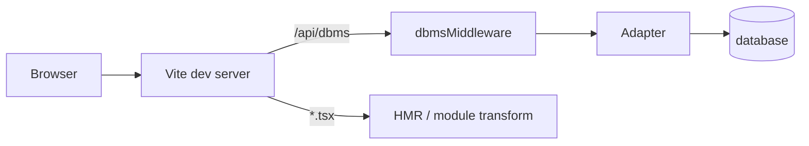

# Custom Vite Plugins & Dev Server Tricks

## Vite as API Server

During development, the main app (`src/`) doesn't use the Fastify API. Instead, it plugs database middleware directly into Vite's dev server:

```ts
// src/vite.config.ts
{
  name: 'dbms-middleware',
  configureServer(server) {
    server.middlewares.use('/api/dbms', dbmsMiddleware);
  },
}
```

This means:
- **One process** serves both the frontend and the API
- No CORS issues (same origin)
- Hot Module Replacement (HMR) works naturally
- No separate terminal for the backend

The middleware handles all CRUD operations, routing to the active database adapter (JSON, CSV, MongoDB, PostgreSQL) based on `ACTIVE_DB_SOURCE`.

### How It Works

Vite's `configureServer` hook gives you access to the Connect middleware stack. You can `.use()` any Express-compatible middleware. The DBMS middleware parses the request body, dispatches to the appropriate adapter, and sends back JSON.



## CSP Patch for d3-dsv

The `d3-dsv` library (used for CSV parsing) internally uses `new Function()` to generate row parsers. Browsers with strict Content Security Policy block `new Function()` because it's equivalent to `eval`.

```ts
{
  name: 'patch-d3-dsv',
  transform(code, id) {
    if (id.includes('d3-dsv')) {
      return code.replace(
        /new Function\("d",\s*"return {" \+ .*/,
        '/* patched: safe closure */ (d) => { /* pre-built parser */ }'
      );
    }
  },
}
```

This Vite plugin intercepts the `d3-dsv` source during module loading and replaces the `new Function()` call with a static closure. The result:
- Same parsing behavior
- No `unsafe-eval` needed in CSP
- No need to fork the dependency or wait for an upstream fix

## WASM Loading

The formula engine's WASM binary is loaded via Vite's asset handling:

```ts
// bridge.ts
import init from './formula-engine/pkg/formula_engine';

let initPromise: Promise<void> | null = null;

async function ensureInit(): Promise<void> {
  if (!initPromise) {
    initPromise = init().catch((err) => {
      initFailed = true;
      console.error('[WASM] Failed to initialize formula engine:', err);
    });
  }
  return initPromise;
}
```

Vite handles WASM imports natively — it serves the `.wasm` file as a static asset and generates the correct instantiation code. No special loader configuration needed.

The `initPromise` pattern ensures:
1. WASM is loaded once (subsequent calls reuse the promise)
2. Concurrent callers don't trigger multiple loads
3. If loading fails, `initFailed` is set and formulas fall back to TS evaluation

## File Watcher Plugin

The file watcher monitors JSON/CSV data files for external changes:

```ts
{
  name: 'file-watcher',
  configureServer(server) {
    initFileWatcher(server.ws);  // Pass Vite's WebSocket server
  },
}
```

When a data file changes (edited in VS Code or another tool), the watcher sends an HMR message through Vite's WebSocket:

```ts
server.ws.send({ type: 'custom', event: 'dbms:reload', data: { entity } });
```

The frontend listens for this event and reloads the affected table. This gives you live-reload for data files — edit a JSON file, see the change instantly in the browser.

## Path Aliases

```ts
// src/vite.config.ts
resolve: {
  alias: { '@': path.resolve(__dirname, '.') }
}

// playground/vite.config.ts
resolve: {
  alias: {
    '@src': path.resolve(__dirname, '../src'),
    '@': path.resolve(__dirname, 'src'),
  }
}
```

The playground uses `@src` to import components from the main app:
```ts
import { TableView } from '@src/components/views/table/TableView';
```

This lets the playground reuse production UI components without duplicating code, while keeping its own components at `@/components/`.

## Tradeoffs

### Middleware vs. separate API server

| | Vite middleware | Separate Fastify API |
|---|---|---|
| Setup | Zero — it's part of Vite | Need to start a second process |
| CORS | Not needed (same origin) | Need `@fastify/cors` |
| Auth | Not needed (single user) | JWT required (multi-user) |
| Performance | Good enough for dev | Better for production |
| WebSocket | Vite's WS (for HMR + data reload) | Fastify WS (for real-time sync) |

The main app uses middleware for development simplicity. The playground uses the Fastify API for production-like multi-user workflows. Same database adapters, different transports.

## References

- [Vite — Plugin API](https://vite.dev/guide/api-plugin.html) — Official documentation on Vite plugin hooks (`configureServer`, `transform`, `resolveId`, `load`).
- [Vite — Server Options](https://vite.dev/config/server-options.html) — Configuration for `server.fs.allow`, CORS, and proxy settings used by the middleware plugins.
- [MDN — Content Security Policy (CSP)](https://developer.mozilla.org/en-US/docs/Web/HTTP/CSP) — Why WASM evaluation requires CSP adjustments (`'unsafe-eval'`) and how the CSP plugin patches response headers.
