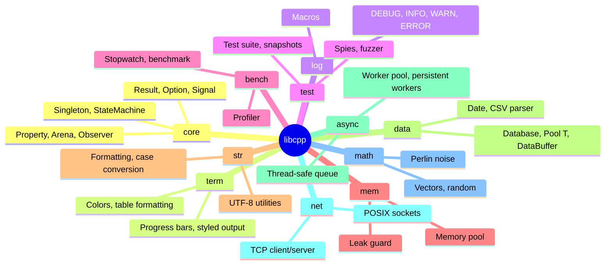

# C++ Native Addon — The Logger

## What It Is

A Node.js native addon built from a C++17 library (`libftpp`). It provides structured logging with the Observer design pattern and decorator chains. Used by the Vite dev server middleware to log database queries.

## Why C++ for a Logger?

Three reasons:

### 1. The 42 School requirement

`libftpp` is a 42 School project. It implements specific design patterns (Observer, Memento, Singleton, State Machine) as a C++ static library. Integrating it into this project serves two purposes: it demonstrates the library in a real application, and it gives the project structured logging for free.

### 2. Zero overhead when disabled

Native addons have zero startup cost when not loaded. The logger is loaded with `createRequire` and wrapped in a try/catch:

```ts
let native: NativeLogger | null = null;
try {
  const require = createRequire(import.meta.url);
  native = require('../lib/libcpp/build/libcpp_logger.node');
} catch {
  // Addon not built — use no-op fallback
}
```

If the addon isn't compiled, the logger silently becomes a no-op. No dependency on CMake for development.

### 3. Observer pattern for log routing

The C++ Observer implementation allows multiple sinks:

```cpp
// Conceptual architecture
Observer<QueryEvent> queryObserver;

// Sink 1: Terminal writer (formatted, colored)
queryObserver.subscribe([](const QueryEvent& e) {
  TermWriter::write(formatQuery(e));
});

// Sink 2: File writer (JSON lines)
queryObserver.subscribe([](const QueryEvent& e) {
  FileWriter::appendLine(toJson(e));
});

// Sink 3: Metrics counter
queryObserver.subscribe([](const QueryEvent& e) {
  metrics.increment(e.source, e.operation);
});
```

Each query event is dispatched to all sinks without the emitter knowing about them. Adding a new sink requires zero changes to the logging code.

## The libftpp Library

The full library has much more than just logging:



Only the Observer + Logger + TermWriter modules are used by the Node addon. The rest exists as the standalone 42 project.

## Build Process

```bash
# From src/lib/libcpp/
make                # Builds libcpp.a (static library)

# The Node addon is built via cmake-js (configured in the root project)
# Automatic on first `make dev` from src/
```

The Makefile produces a static library. A separate `binding.gyp` or CMakeLists.txt compiles the Node addon, linking against the static library.

## How Queries Are Logged

```ts
// src/server/logger/index.ts
export function emitQuery(source: string, op: string, table: string, query: string) {
  if (native) {
    native.logQuery(source, op, table, query);
  }
}

// Called from ops adapters:
// src/server/ops/postgresOps.ts
emitQuery('postgresql', 'UPDATE', tableName, `UPDATE ${table} SET ${field} = $1 WHERE id = $2`);
```

The native addon formats the query with colors, timestamps, and source tags, then writes to stderr. The Vite terminal shows something like:

```
[12:34:56] postgresql UPDATE pages  →  UPDATE pages SET name = $1 WHERE id = $2
[12:34:56] mongodb    INSERT pages  →  db.pages.insertOne({ name: "Hello" })
```

## Verbose vs Compact Mode

```bash
make dev          # Compact: one line per query
make dev-verbose  # Verbose: full query with colors, boxes, timing
```

The `DBMS_VERBOSE` env variable controls which TermWriter style is used. The native addon checks it at startup and configures the Observer pipeline accordingly.

## Graceful Degradation

This is the key design decision: **the project works without the C++ addon.**

```ts
// If native is null, these are no-ops
export function emitQuery(source, op, table, query) {
  if (native) native.logQuery(source, op, table, query);
  // If !native, nothing happens. No error, no fallback.
}
```

New contributors can `pnpm install && pnpm dev:src` without installing CMake, gcc, or any C++ toolchain. They just won't see query logs in the terminal. When they're ready to build the addon, `make build-native` from `src/` compiles it.

## When to Extend the Addon

Add to the native addon when:
- You need terminal output with specific formatting (box drawing, colors, tables)
- You need Observer-based event routing with zero-copy dispatch
- You need the C++ library's facilities (memory pool, profiler, etc.)

Don't use the addon for:
- Anything that needs to run in the browser (native addons are Node.js only)
- Simple `console.log` calls (just use `console.log`)
- Hot-reloadable logic (native addons require recompilation on change)

## References

- [Node.js — Node-API (N-API)](https://nodejs.org/api/n-api.html) — The ABI-stable C API for building native addons that work across Node.js versions without recompilation.
- [node-addon-api — C++ Wrapper](https://github.com/nodejs/node-addon-api) — The official C++ binding layer over Node-API, used for cleaner addon code.
- [Node.js — C++ Addons](https://nodejs.org/api/addons.html) — General guide on building and loading native addons in Node.js.
- [Wikipedia — Observer Pattern](https://en.wikipedia.org/wiki/Observer_pattern) — The design pattern implemented in libftpp for event-driven logging and state notifications.
