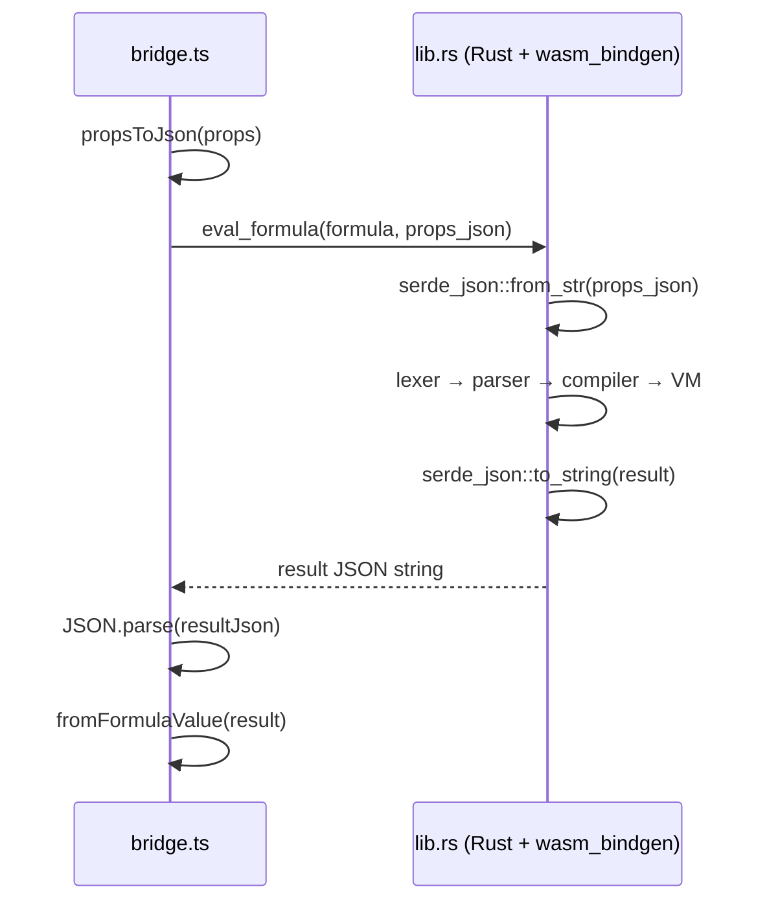

# WASM Bridge — How TypeScript Talks to Rust

## The Boundary Problem

WASM and JavaScript live in separate memory spaces. They can't share objects, strings, or references directly. Everything crossing the boundary must be serialized.

There are three approaches:
1. **Shared linear memory** — pass pointers, manage allocation manually. Fast but dangerous.
2. **Typed arrays** — pass buffers back and forth. Good for bulk numeric data.
3. **JSON strings** — serialize to JSON on one side, deserialize on the other. Simple and safe.

We use option 3. Here's why.

## Why JSON?

Our data crossing the boundary looks like:
```ts
// TypeScript → Rust
{ price: 49.99, name: "Widget", active: true, tags: ["A", "B"] }

// Rust → TypeScript
{ ok: true, value: { type: "Number", value: 149.97 } }
```

This is heterogeneous, nested, and variable-shaped. JSON handles it naturally. Typed arrays would require a custom binary protocol.

### The Cost

JSON serialization for a typical row (~10 properties) takes ~0.01ms. For 500 rows, that's ~5ms total. The VM execution is ~2ms. So serialization is actually the bottleneck.

For our use case, this is acceptable. If we needed to process 100K rows, we'd switch to a binary protocol. At 500 rows, simplicity wins.

## The Bridge Architecture



## Key Bridge Functions

### Initialization (lazy, singleton)

```ts
let wasmEngine: WasmEngine | null = null;
let initPromise: Promise<void> | null = null;
let initFailed = false;

export async function initFormulaEngine(): Promise<boolean> {
  if (wasmEngine) return true;     // Already loaded
  if (initFailed) return false;    // Already failed, don't retry

  if (!initPromise) {
    initPromise = loadWasm()
      .then((engine) => { wasmEngine = engine; })
      .catch((err) => { initFailed = true; });
  }

  await initPromise;
  return wasmEngine !== null;
}
```

Three states: not loaded, loading (promise pending), loaded (or failed). The `initPromise` dedup means calling `initFormulaEngine()` from 10 components triggers only one WASM download.

### Compilation + Handle Caching

```ts
const formulaHandleCache = new Map<string, number>();

export function compileFormula(formula: string): CompileResult | null {
  if (!wasmEngine) return null;

  const cached = formulaHandleCache.get(formula);
  if (cached !== undefined) {
    return { ok: true, handle: cached };
  }

  const resultJson = wasmEngine.compile(formula);
  const result: CompileResult = JSON.parse(resultJson);

  if (result.ok && result.handle !== undefined) {
    formulaHandleCache.set(formula, result.handle);
  }

  return result;
}
```

Handles are integers referencing compiled chunks inside the WASM module's memory. The cache maps formula strings to handles, avoiding recompilation.

### Batch Evaluation

```ts
export function batchEvaluate(formula: string, rows: PropertyMap[]): unknown[] {
  const compiled = compileFormula(formula);
  if (!compiled?.ok) return rows.map(() => '');

  const rowsJson = JSON.stringify(rows.map(r => {
    const converted: Record<string, FormulaValue> = {};
    for (const [key, val] of Object.entries(r)) {
      converted[key] = toJsonValue(val);
    }
    return converted;
  }));

  const resultJson = wasmEngine.batch_evaluate(compiled.handle, rowsJson);
  const result: BatchResult = JSON.parse(resultJson);

  return result.ok ? result.values.map(fromFormulaValue) : rows.map(() => '');
}
```

Instead of calling `evaluate` 500 times (500 JSON round-trips), `batch_evaluate` sends all rows in one JSON array. The Rust side loops internally — one serialization round-trip for the whole batch.

## Type Conversion

### TypeScript → Rust (`toJsonValue`)

```ts
export function toJsonValue(val: unknown): FormulaValue {
  if (val === null || val === undefined) return { type: 'Empty' };
  if (typeof val === 'number')  return { type: 'Number', value: val };
  if (typeof val === 'boolean') return { type: 'Boolean', value: val };
  if (typeof val === 'string')  return { type: 'Text', value: val };
  if (Array.isArray(val))       return { type: 'Array', value: val.map(toJsonValue) };
  return { type: 'Text', value: String(val) };
}
```

### Rust → TypeScript (`fromFormulaValue`)

```ts
export function fromFormulaValue(val: FormulaValue): unknown {
  switch (val.type) {
    case 'Number':  return val.value;
    case 'Text':    return val.value;
    case 'Boolean': return val.value;
    case 'Date':    return val.value;
    case 'Array':   return val.value.map(fromFormulaValue);
    case 'Empty':   return '';
    default:        return '';
  }
}
```

The tagged-union format (`{ type: 'Number', value: 42 }`) matches on both sides because Rust's `serde(tag = "type", content = "value")` produces the same JSON structure.

## Graceful Degradation

```ts
export function evalFormula(formula: string, props: PropertyMap): unknown {
  if (!wasmEngine) return '';  // WASM not loaded — return empty
  try {
    // ... evaluate ...
  } catch {
    return '';  // Any error — return empty, don't crash
  }
}
```

Every bridge function checks `wasmEngine !== null` before calling into WASM. If WASM failed to load (missing `.wasm` file, browser doesn't support WASM, etc.), all functions return safe defaults. The app works — formulas just show blank values instead of computed results.

## Handle Lifecycle

```ts
export function freeFormula(handle: number): void {
  if (!wasmEngine) return;
  wasmEngine.free_formula(handle);
  // Clean up the TS-side cache too
  for (const [formula, h] of formulaHandleCache) {
    if (h === handle) {
      formulaHandleCache.delete(formula);
      break;
    }
  }
}
```

Compiled formulas occupy memory inside the WASM module. When a formula column is deleted, `freeFormula` releases that memory. Without this, deleted formulas would leak inside the WASM heap.

## References

- [wasm-bindgen Guide](https://rustwasm.github.io/docs/wasm-bindgen/) — The Rust↔JavaScript interop layer that generates the TypeScript bindings used by the bridge module.
- [wasm-pack Documentation](https://rustwasm.github.io/docs/wasm-pack/) — The build tool that produces the `.wasm` binary and JS glue code loaded by `initWasm()`.
- [MDN — WebAssembly JavaScript Interface](https://developer.mozilla.org/en-US/docs/WebAssembly/JavaScript_interface) — The browser APIs (`WebAssembly.instantiate`, `WebAssembly.Memory`) underlying the WASM module lifecycle.
- [MDN — `JSON.stringify()` / `JSON.parse()`](https://developer.mozilla.org/en-US/docs/Web/JavaScript/Reference/Global_Objects/JSON/stringify) — The serialization layer used to pass structured data across the JS↔WASM boundary.
